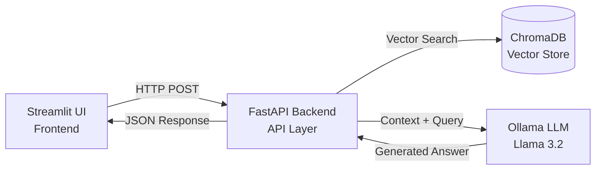

# Medical RAG Assistant 

A production-ready Retrieval-Augmented Generation (RAG) assistant designed for answering complex medical queries based on loaded medical research documentation.

Built using **FastAPI**, **Streamlit**, **ChromaDB**, and **Ollama (Llama 3.2)**.

---

## System Architecture

