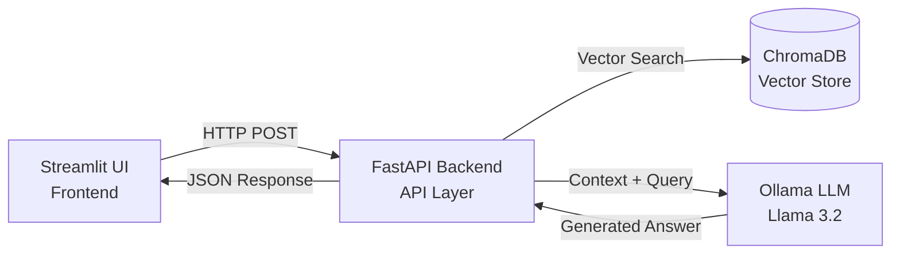

# Medical RAG Assistant 

A production-ready Retrieval-Augmented Generation (RAG) assistant designed for answering complex medical queries based on loaded medical research documentation.

Built using **FastAPI**, **Streamlit**, **ChromaDB**, and **Ollama (Llama 3.2)**.

---

## System Architecture

Medical_RAG_Assistant/
├── backend/
│   ├── main.py              # FastAPI application entry point & routing
│   ├── rag_engine.py        # Core RAG pipeline, embedding search & prompt logic
│   ├── requirements.txt     # Backend-specific dependencies
│   └── tests/               # Pytest suite for backend routes
├── frontend/
│   ├── app.py               # Streamlit user interface & chat component
│   └── requirements.txt     # Frontend dependencies
├── notebooks/               # Data ingestion, processing, and prototyping
└── README.md                # System documentation
python -m venv .venv
.venv\Scripts\activate
cd backend
pip install -r requirements.txt
uvicorn main:app --reload
cd frontend
pip install -r requirements.txt
streamlit run app.py
cd backend
pytest
