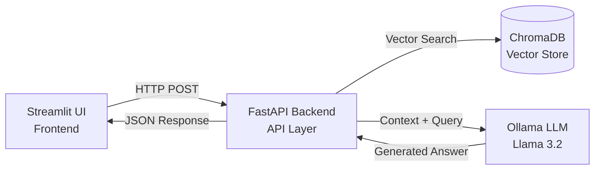
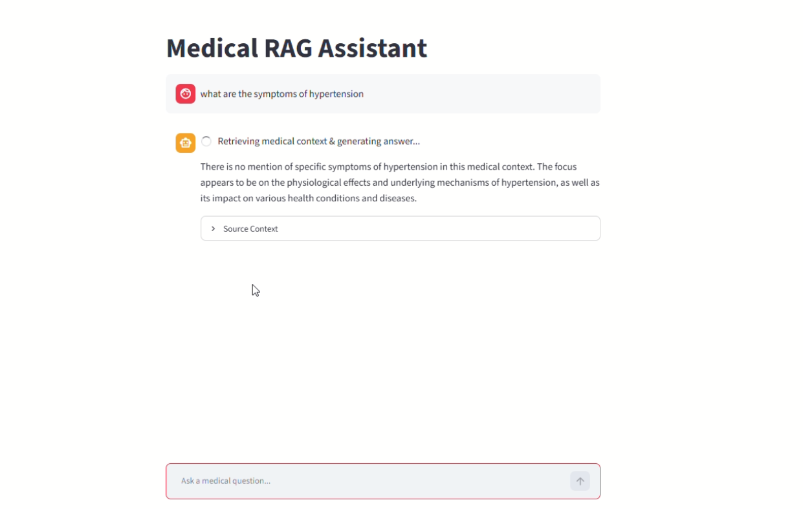

# Medical RAG Assistant 

A production-ready Retrieval-Augmented Generation (RAG) assistant designed for answering complex medical queries based on loaded medical research documentation.

Built using **FastAPI**, **Streamlit**, **ChromaDB**, and **Ollama (Llama 3.2)**.

---

## System Architecture


---

## Domain & Data

This project builds a medical RAG assistant using research documentation on cardiovascular aging and heart failure (e.g. `heart_failure.pdf`). The source document was processed, chunked, embedded, and stored in a persistent ChromaDB vector store to allow grounded, cited question answering.

---

## Tech Stack

- **Backend:** FastAPI
- **Frontend:** Streamlit
- **Vector Store:** ChromaDB (persistent)
- **Embeddings:** sentence-transformers (all-MiniLM-L6-v2)
- **LLM:** Ollama (Llama 3.2)

---

## Project Structure
Medical-RAG-Assistant/
├── backend/
│   ├── app/
│   │   ├── main.py
│   │   ├── api/routes/query.py
│   │   ├── core/config.py
│   │   ├── schemas/query.py
│   │   ├── services/retrieval.py
│   │   ├── services/generation.py
│   │   └── utils/logging_config.py
│   ├── data/vector_store/
│   ├── Dockerfile
│   ├── requirements.txt
│   └── .env.example
├── frontend/
│   ├── app.py
│   └── requirements.txt
├── notebooks/
│   └── rag_pipeline.ipynb
└── README.md
---

## Backend Setup

```bash
cd backend
python -m venv .venv
.venv\Scripts\activate
pip install -r requirements.txt
uvicorn app.main:app --reload
Environment Variables
| Variable | Description | Example |
|---|---|---|
| EMBED_MODEL | Sentence-transformers embedding model | all-MiniLM-L6-v2 |
| OLLAMA_MODEL | Ollama LLM model name | llama3.2:1b |
| VECTOR_STORE_PATH | Path to persisted ChromaDB store | ./data/vector_store |
| COLLECTION_NAME | ChromaDB collection name | medical_docs |
API Reference
GET /health
Returns API status.
POST /query
Retrieves relevant context and generates a grounded answer.
Example request
curl -X POST http://localhost:8000/query \
  -H "Content-Type: application/json" \
  -d '{"question": "What are the main causes of heart failure in aging?"}'
  Example response:
  {
  "answer": "...",
  "sources": ["...", "..."]
}
Evaluation Results
Ten test questions were run against the RAG pipeline in notebooks/rag_pipeline.ipynb to evaluate retrieval relevance and answer grounding. See the notebook's evaluation table for the full question/source/answer/correctness breakdown.
Screenshots
